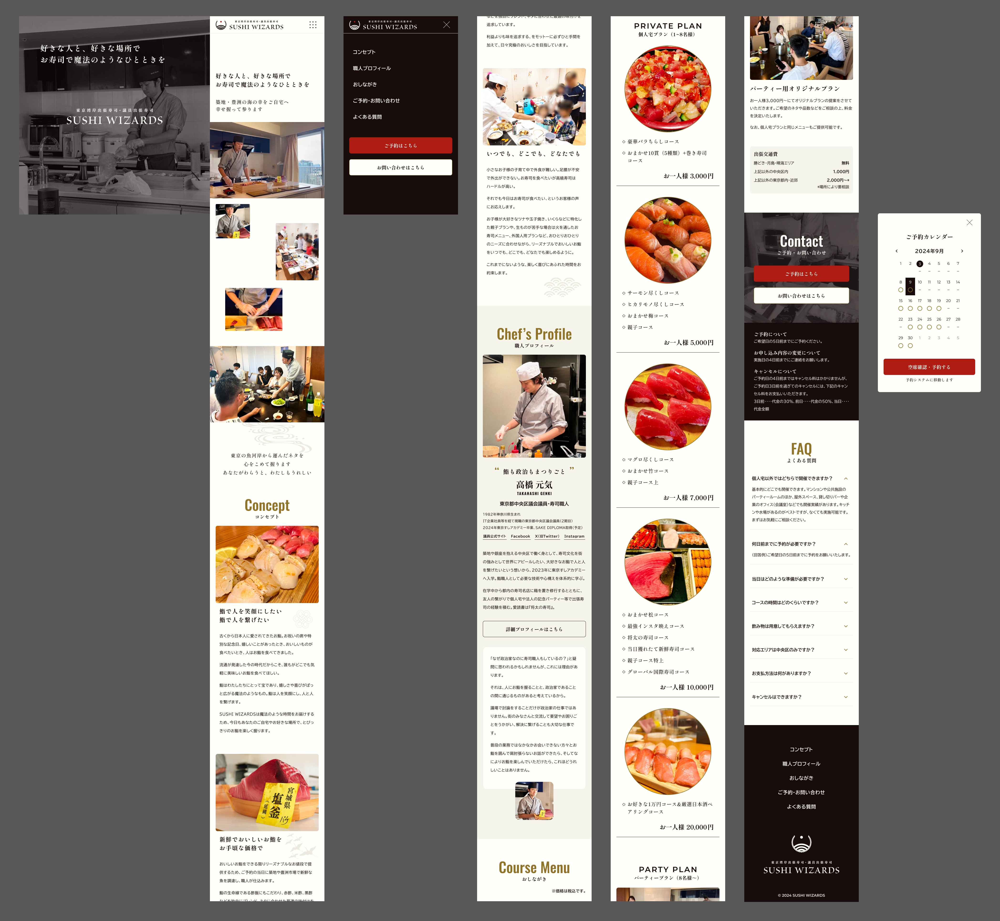
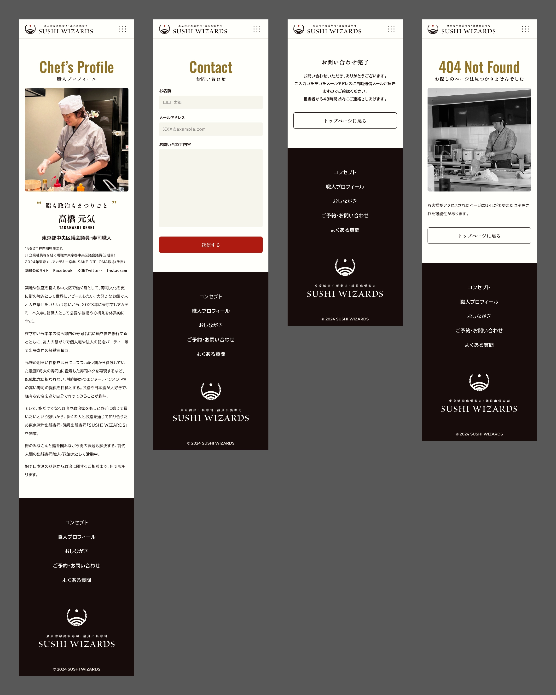

## デザイン全体

サービスが出張寿司ですので、「自宅に呼んでも問題ないか」「お寿司がおいしそうで、頼みたいと思えるか」など、ユーザーが感じるであろう不安を解消することが重要だと考えました。

ファーストビューに職人さんの動画を置くことでおおまかな人柄や振る舞いを知ってもらい、メインコンテンツには実際に握られたお寿司の画像を多く配置することで、「良いサービスだな」と思ってもらうことを目指しました。

## ポイント

職人さんが中央区の議員ということで、築地や銀座などの歴史ある寿司文化を広めたいという思いをお持ちでした。築地市場や日本橋魚河岸など、中央区の寿司にまつわる歴史を調べ、川や海のモチーフを取り入れました。

## ロゴデザインについて

今回は出張寿司サービスの立ち上げに付随するWebサイトデザインでしたので、ファビコンや名刺などにも使ってもらうことを想定しオリジナルのロゴを制作しました。

職人の方の愛読書が漫画『将太の寿司』ということだったので、主人公の将太が修行する店の名前から鳥のイメージ、中央区の歴史から青海波の文様、熱い思いを表す太陽などのモチーフをまとめ、『SUSHI WIZARDS』の名にふさわしいロゴを作りました。

## リンク

[Figma](https://www.figma.com/design/Yri32R6sSSlupy0pCPfsbD/240903_SUSHI-WIZARDS_Competition?node-id=5-57916&t=TRgQLDyp2lZKKZUP-1)